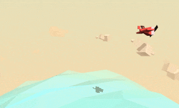

This is a three.js demo of a plane flying above a sea.

It was written following 
[this](http://tympanus.net/codrops/2016/04/26/the-aviator-animating-basic-3d-scene-threejs/) 
tutorial. I didn't implement any game logic since I only wanted
to follow along to get more familiar with three.js.

